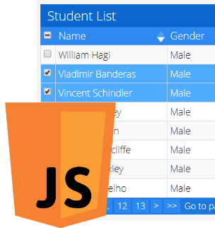
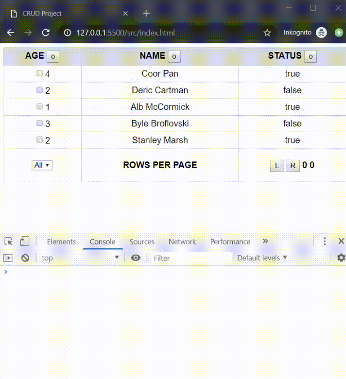

# Create, Read, Update and Delete ![badge]

CRUD vanilla JS project, HTML table with buttons in table head,
which allow to sort the content of the column.

[badge]: https://img.shields.io/badge/status-stable-green.svg

### Project completed

Missing:

- Turning pages, items aren't hidden when user turns the page.
- Proper buttons icons, which show if sorting is ascending or descending (▲ or ▼).
- Checkbox, which highlight selected row
- JSDoc

### Features

1. Table head with sort buttons
   - Sort the items of an array, alphabetic and numeric, ascending or descending. Highlight active sorting button/method
2. All CRUD features
3. In the first row is a checkbox, which highlight the whole row
4. Display number of elements in the table's footer
5. Dropdown menu in footer to limit amount of displayed rows

### Subtask

- [Lint/Prettier] - Prevent stylistic errors -done
- [JSDoc] - Document the code -failed
- [Git] - Create repository on github and push/upload it -done
- [DRY] - Don't repeat yourself and provide clean code -done
